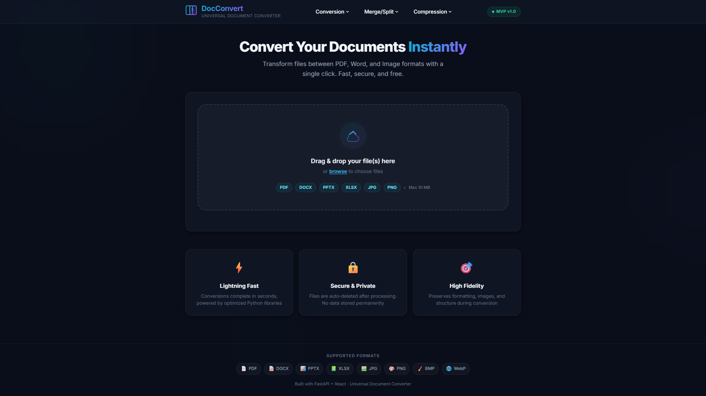

# Universal Document Converter

## 🌍 Live Demo

👉 https://universal-doc-converter.onrender.com/

A production-ready full-stack web platform for converting documents between PDF, Word, and Image formats.

## 📌 Overview

Universal Document Converter is a full-stack web application that allows users to convert, compress, and manipulate documents efficiently. The platform is designed with a modular architecture and optimized for fast processing and scalability.

**Frontend:** React (Vite) · **Backend:** FastAPI (Python) · **Storage:** Local filesystem (S3-ready)

---

## ✨ Features

- **PDF → Word** — Convert PDF to editable DOCX
- **Word → PDF** — Convert DOCX to PDF format  
- **Image → PDF** — Convert JPG/PNG/BMP/WebP/TIFF to PDF
- **Drag & Drop** upload with real-time progress
- **Auto-cleanup** — files are automatically deleted after 1 hour
- **UUID-based** unique file naming (no collisions)
- **Responsive UI** — works on desktop and mobile
- **Dark glassmorphism** design with smooth animations


# Screen Shot

---

## 🚀 Quick Start

### Prerequisites
- **Python 3.10+** and **pip**
- **Node.js 18+** and **npm**

### 1. Backend (FastAPI)

```bash
# Navigate to backend directory
cd backend

# Create virtual environment
python -m venv venv

# Activate virtual environment
# Windows:
venv\Scripts\activate
# macOS/Linux:
source venv/bin/activate

# Install dependencies
pip install -r requirements.txt

# Start the server
uvicorn app.main:app --reload --port 8000
```

The API will be available at `http://localhost:8000`  
API docs at `http://localhost:8000/docs`

### 2. Frontend (React + Vite)

```bash
# In a new terminal, navigate to frontend
cd frontend

# Install dependencies
npm install

# Start dev server
npm run dev
```

The UI will be available at `http://localhost:5173`

---

## 📁 Project Structure

```
universal-doc-converter/
├── backend/
│   ├── app/
│   │   ├── main.py          # FastAPI entry point
│   │   ├── config.py        # Settings & constants
│   │   ├── models.py        # Pydantic schemas
│   │   ├── routers/         # API endpoints
│   │   │   ├── upload.py    # POST /api/upload
│   │   │   ├── convert.py   # POST /api/convert
│   │   │   └── download.py  # GET /api/download/{id}
│   │   ├── services/        # Conversion logic
│   │   │   ├── converter.py # Orchestrator
│   │   │   ├── pdf_to_word.py
│   │   │   ├── word_to_pdf.py
│   │   │   └── image_to_pdf.py
│   │   └── utils/           # Helpers
│   │       ├── file_handler.py
│   │       └── storage.py
│   ├── requirements.txt
│   └── .env
├── frontend/
│   ├── src/
│   │   ├── components/      # React components
│   │   ├── hooks/           # Custom hooks
│   │   ├── services/        # API layer
│   │   ├── App.jsx
│   │   └── index.css
│   ├── vite.config.js
│   └── package.json
└── README.md
```

---

## 🔌 API Endpoints

| Method | Endpoint | Description |
|--------|----------|-------------|
| `GET` | `/api/health` | Health check |
| `POST` | `/api/upload` | Upload a file (multipart/form-data) |
| `POST` | `/api/convert` | Convert an uploaded file |
| `GET` | `/api/download/{file_id}` | Download a converted file |

---

## 🚢 Deployment

### Backend → Render / Railway

1. Push code to GitHub
2. Connect repo on [Render](https://render.com) or [Railway](https://railway.app)
3. Set build command: `pip install -r requirements.txt`
4. Set start command: `uvicorn app.main:app --host 0.0.0.0 --port $PORT`
5. Set env vars: `CORS_ORIGINS=https://your-frontend.vercel.app`

### Frontend → Vercel

1. Connect GitHub repo on [Vercel](https://vercel.com)
2. Framework preset: Vite
3. Set env var: `VITE_API_URL=https://your-backend.onrender.com`
4. Deploy

---

## ⚠️ Known Limitations: Complex DOCX Files & Formatting

Because this platform is designed to be hosted on free Linux servers (like Render), it relies on the open-source **LibreOffice** engine to convert Microsoft Word files.

While simple documents (text, standard paragraphs, basic tables) convert perfectly, **highly complex `.docx` files will experience formatting shifts, overlapping text, or cut-off tables.**

**Why does this happen?**
Microsoft Word calculates the exact coordinates of "floating elements" (like text boxes, images with tight wrapping, or overlapping logos) using proprietary, closed-source math. Because LibreOffice does not have access to Microsoft's source code, it has to guess how to render these complex layouts. If the math is slightly off, a text box that fits perfectly in Word might expand and overlap surrounding text when rendered by LibreOffice on a Linux server.

**How to get perfect conversions:**
1. **Avoid floating elements:** Always set images and text boxes to "In Line with Text". Use invisible tables instead of absolute positioning.
2. **Windows Hosting:** If you need 100% pixel-perfect conversions for any complex file, host this backend on a Windows Server. The Python code will automatically bypass LibreOffice and use the literal Microsoft Word engine via `win32com`.

---

## 🔮 Advanced Features (Roadmap)

1. **🤖 AI-Powered OCR** — Use Tesseract OCR to extract text from scanned PDFs/images
2. **🧠 AI Document Summarization** — Integrate OpenAI/Gemini for auto-summarization
3. **📊 Batch Conversion** — Upload multiple files and download as ZIP

---

## 📝 License

MIT
